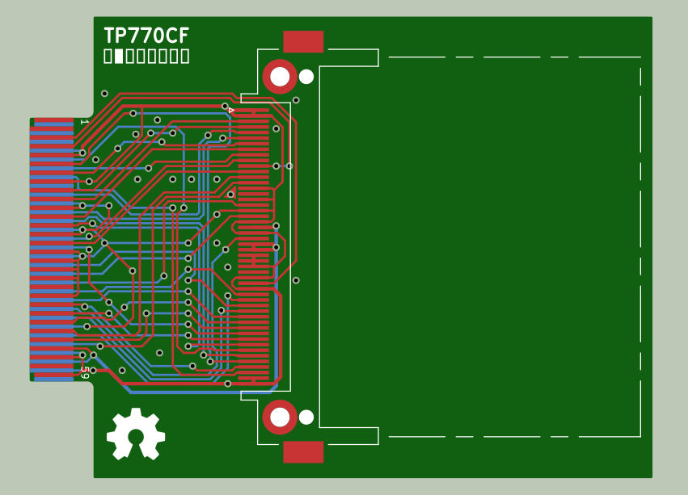
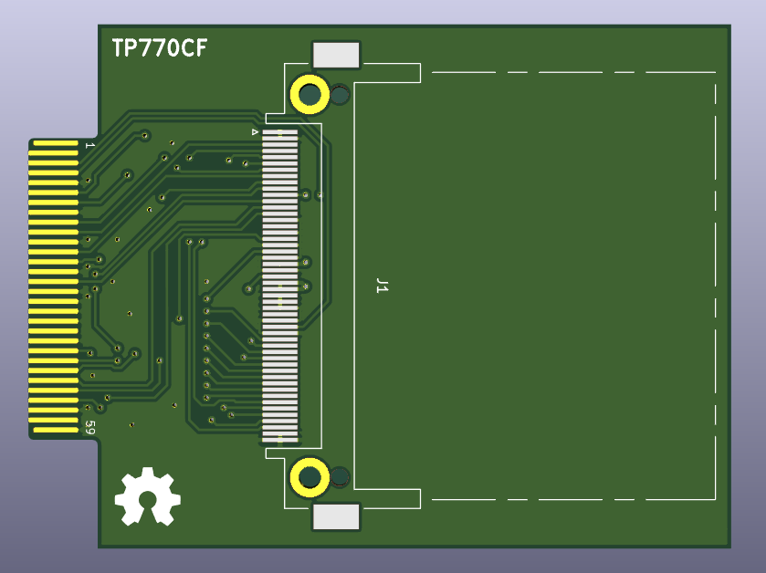

# TP770CF
PCB layout for an adapter from the ThinkPad 770 series IDE port to CompactFlash. 


**Please note:** This design has *not* been tested - it is possible that it contains mistakes or omissions, and I take no responsibility for potential damage to any machine it is connected to, nor any potential loss of data which may result from its use. I am relasing this as [Open-Source Hardware](https://www.oshwa.org) in the hope that others can help verify the design. The PCB was created with [Kicad](https://www.kicad.org), a free and open source schematic capture and PCB layout package. 

This board should allow you to plug a CF card directly into the on-board proprietary IDE connector, obviating the need for the caddy. The PCB is double sided and should have either 0.8 or 1mm thickness (untested). This is how the pins are connected: 

````
CF  Function  Caddy   IDE   Caddy  Function  CF
----------------------------------------------
     Slave      1     A  B     4   Slave 
     Master     3     C  D     6   Master  
                      -  -     
41   Reset      5     1  2     8   GND 
 6   DD7        7     3  4    10   DD8      47
 5   DD6       12     5  6    11   DD9      48
 4   DD5       13     7  8    14   DD10     49
 3   DD4       18     9 10    17   DD11     27
 2   DD3       19    11 12    22   DD12     28
23   DD2       24    13 14    23   DD13     29
22   DD1       25    15 16    28   DD14     30
21   DD0       30    17 18    29   DD15     31
     GND       32    19 -          n/c 
43   DMARQ     34    21 22    33   GND 
35   DIOW      36    23 24    35   GND 
34   DIOR      38    25 26    37   GND 
42   IORDY     40    27 28    39   CSEL      
44   DMACK     42    29 30    41   GND 
37   INTRQ     44    31 32    43   IOCS16   24
19   DA1       46    33 34    45   PDIAG    46
20   DA0       47    35 36    50   DA2      18
 7   CS0       49    37 38    52   CS1      32
45   DASP      51    39 40    54   GND 
     +5V       53    41 42    56   +5V      
     GND       59    43 44    57   TYPE       
````
**Notes**
* Caddy pin #1 is top left when facing connector on caddy, pin #60 bottom right (see picture below).
* Caddy pins 9, 15, 20, 21, 26, 27, 31, 48, 55 and 58 are connected to GND.
* Caddy pins 2, 16 and 60 appear to be n/c.
* CF socket pins #13, #36 and #38 should be connected to +5V.
* CF socket pins #1, #8-12, #14-17, #25, #26 and #50 should be connected to GND.
* The CF card is hard wired as master.
* Connections include DMARQ & DMACK, which are required for DMA operation.


### Layout
This is how the tracks are laid out (copper pours not shown here): 



A 3D preview of the finished board: 




